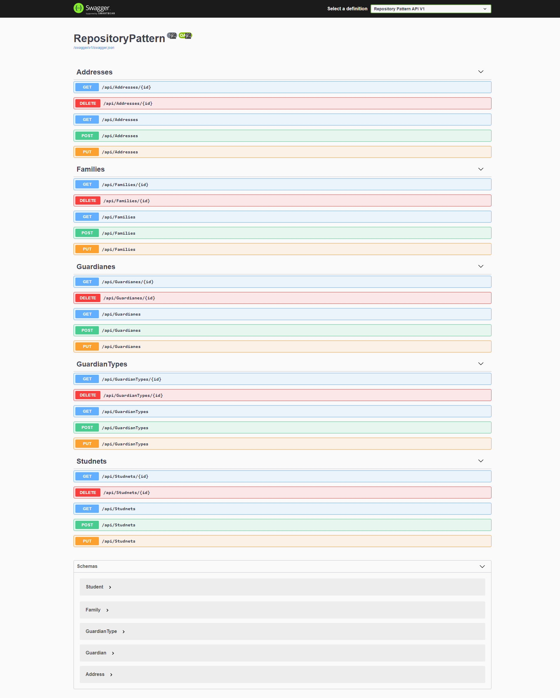

# Repository Pattern (Students Course API) 

## Introduction 
> In this application, we will look at 'repository pattern' implementations. The general application will be as follows.An app that shows the data recorded during the course registration of requirements.This Project uses swagger. 
### Database 
- **Ms SQL**
- **SQLite**
- Desigen
 **Qeyd:** Families Table Added Colum Code. Code unique text. MaxLength 7;
## Version 1 => App : Use Minimal Repository Pattern , N Layer Sturuct
***
### Api Publish Link => [Api Link](https://repopattern.herokuapp.com/)
### Api Publish Link => https://repopattern.herokuapp.com/
### Project => [Link](/Version_1)

### Overview
> The program uses 
> - **Simple Repository Pattern** 
> - **Generic Repository**
> - **N Layer Architecture**

> In this program, App version
>    - Main App : Using MsSql => [Link](https://github.com/DrMadWill/RepositoryPattern/tree/main/Version_1/RepositoryPattern)
>    - Published App : Using SQLite and Docker => [Link](https://github.com/DrMadWill/RepositoryPattern/tree/main/Version_1/version_publish)

## Version 2 => App : Uses Unit Of Work Pattern, Generic Repostory, Repository Pattern and N Layer Architecture  
***

### Api Publish Link => [Api Link](https://unirepoapp.herokuapp.com/)
### Api Publish Link => https://unirepoapp.herokuapp.com/
### Project => [Link](/Version_2)

### Overview
> The program uses 
> - **Unit Of Work Pattern** 
> -  **Repository Pattern** 
> - **Generic Repository (Universal)**
> - **N Layer Architecture**
> - **Lazy Loading**

> In this program, **App version**
>  - Main App : Using MsSql => [Link](/Version_2/Main/)
>  - Published App : Using SQLite and Docker => [Link](/Version_2/V_Publish/)